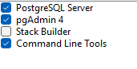

Tere, mina olen Erki ja
siin on minu CGI suvepraktika proovitöö 2025:

<h2>Kuidas minu programmi käivitada:</h2>

Kuna ma ise kasutasin programmi kirjutamiseks "Intellij IDEA ultimate edition" programmi siis näitan ka kuidas seda käima saada.
Esmalt tuleks gitist laadida programmi kaust alla. Seejärel laadida alla andmebaas 
 
 
Kuna kasutan andmebaasiks postgres andmebaasi, tuleks lisaks ka installeerida PostgreSQL endile. Installerid saab [siit](https://www.enterprisedb.com/downloads/postgres-postgresql-downloads) ja tuleks võtta versioon 17.4. 
Kui avada installer, installeris tekib võimalus valida mida installida, sealt valida kõik peale StackBuilderi:    Järgmisena jätta valitud kaust, peale seda tuleb panna PostgreSQL superUser(kasutaja millega saab kõigele ligi) parool, parool peab olema selline mis jääb meelde(hiljem läheb vaja), peale seda küsib porti mida server kuulama hakkab(tavaliselt kas 5432 või 5433), see jääb nii nagu on, see port number võiks meelde jätta. Järgmisena jätta [Default Locale] ja alustada installeerimist.
Peale installimise lõpetamist avada programm "pgAdmin4", kus avaneb ekraan:
  Peale seda avaneb ekraan, kus tuleb sisestada parool mille salvestasid varem SuperUserile. Kui sisestad parooli saab ligi Database serverile. nüüd kui vajutada paremat klikki Databases  
seal "Create" -> "Database...". Avanenud aknas tuleb anda Database lüngale nimi "lennuddb"   ja vajutada nuppu "save", see võib visata mingitsorti errori, sellepeale vajutame "close". Peale seda vajutame uuesti paremat klikki Databases peale ja vajutame refresh. Peale seda võib panna programmi "pgAdmin 4" kinni.

<h2>Intellij IDEA</h2>
Nüüd kui andmebaas üles seatud, avame projekti kausta Intellij projektina. Kaust avatud tuleb veenduda, et oleks kõige uuem Intellij versioon ja project structure oleks selline: 
 
Nüüd kui struktuur on laetud, tuleb muuta "application.properties" väärtusi,